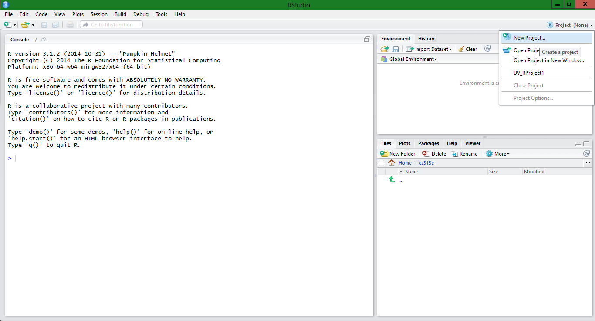

This is an introductory step by step guide in creating your first R project and developing data visualization plots. You will also get a brief glipse into SQL through the use of SQL queries in RStudio.

##Getting Started - Create an R Project

Open RStudio and create a new project. Locate the Project dropdown menu in the top right side of the screen. Select 'New Project...'



Create the Project in a preffered directory. Add three folders to the directory:
- 00 Doc
- 01 Data
- 02 Visualizations

The Rmarkdown file with all non-generated image files will go in the Doc folder. All Rscript files that contain all R code for the project will go in the Data folder. All image files generated from R code in the Data folder will be go in the Visualizations folder.

##Creating Dataframes

There are four different data structures stored on the RestfulRel Server that we need to access for this project. The data will be stored in dataframes.

To access the data, a call is made to request the information. The code to associate the SQL query to a defined variable in R looks like this:

```
df <- data.frame(eval(parse(text=substring(getURL(URLencode('http://129.152.144.84:5001/rest/native/?query="yourQuery"'), httpheader=c(DB='jdbc:oracle:thin:@129.152.144.84:1521/PDB1.usuniversi01134.oraclecloud.internal', USER='DV_ORDERS', PASS='orcl', MODE='native_mode', MODEL='model', returnFor = 'R', returnDimensions = 'False'), verbose = TRUE), 1, 2^31-1))))
```

The SQL query can be inputted where "yourQuery" is located in the above R code.

In our case, the queries sent are as follow: 
- select * from customers
- select * from orders
- select * from order_details
- select * from items

The dataframes created and the outputs can be seen below.

####Library Calls
```{r}
library("RCurl")
library("ggplot2")
```

####Customers Dataframe
```{r}
source("../01 Data/create_customers.R", echo = TRUE)
```

####Orders Dataframe
```{r}
source("../01 Data/create_orders.R", echo = TRUE)
```

####Order Details Dataframe
```{r}
source("../01 Data/create_order_details.R", echo = TRUE)
```

####Items Dataframe
```{r}
source("../01 Data/create_items.R", echo = TRUE)
```

###The Combined Dataframe

One more dataframe will be constructed, but the data will be sourced from all of the previous tables. The SQL query used for this data frame is much more complex.

```
select * from orders o join customers c on o.customer_id = c.customer_id join order_details d on o.order_id = d.order_id 
join items i on d.item_id = i.item_id
```

This data frame looks like this:

```{r}
source("../01 Data/create_combined.R", echo = TRUE)
```

##Plots

Now we will create a few interesting plots using the data we have stored from the database.

####Ship Date vs. Order Date for Unit Price faceted by State

This plot takes the Order Date and Shipped Date in the x and y, respectively. The plot then color codes according to Unit Price and then facets to produce a different plot for each state.

```{r}
source("../01 Data/plot 1.R", echo = TRUE)
```

####Ship Date vs. Order Date for Item Title faceted by State

This plot takes the Order Date and Shipped Date in the x and y, respectively. The plot then color codes according to the title of the item purchased and then facets to produce a different plot for each state.


```{r}
source("../01 Data/plot 2.R", echo = TRUE)
```

####Ship Date vs. Order Date for Item Artist faceted by State

This plot takes the Order Date and Shipped Date in the x and y, respectively. The plot then color codes according to the artist of each album (item) purchased and then facets to produce a different plot for each state.

```{r}
source("../01 Data/plot 3.R", echo = TRUE)
```

####Customer City vs. Customer State

```{r}
source("../01 Data/plot 4.R", echo = TRUE)
```

####Plot Title 5
####Plot Title 6
####Plot Title 7